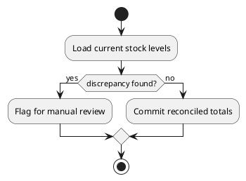

## When to generate a diagram

Generate an activity diagram for an algorithm when it is:
- **Unusual or unorthodox** — not a textbook/standard approach, has a non-obvious control
  flow, or deviates from the common way to solve this kind of problem.
- **Core business logic** — encodes a domain rule, pricing/eligibility/matching logic, a
  state machine, or anything where getting the flow wrong has real consequences.
- **Particularly relevant to the project** — the kind of algorithm a teammate would need
  a diagram to safely modify later.

Skip it for: sorting, searching, generic data structure operations, standard library
usage, CRUD, or anything a competent dev recognizes at a glance. Do not generate one "for
every bubble sort."

When unsure whether an algorithm qualifies, err toward asking the user rather than
silently skipping or silently generating.

## Workflow

1. **Before writing the algorithm's code**, draft the PlantUML activity diagram
   describing its control flow (decisions, branches, loops, terminal states).
2. **Flag it to the user** — state explicitly that this algorithm qualifies and a diagram
   is being written first, so it doesn't happen silently.
3. Save the diagram (see locations/naming below).
4. Implement the code to match the diagram. If the implementation ends up diverging from
   the drafted flow, update the diagram to match before finishing.

## Where to save

Detect where existing diagrams already live in the project (look for `.puml` files —
common locations: `doc/`, `docs/`, `Modelisation/`). Save the new diagram there,
alongside the others.

If no existing diagram folder is found, ask the user where to put it rather than
guessing a new convention.

## Naming

File name matches the algorithm/function name, snake_case or the project's existing
convention, e.g. `reconcile_inventory.puml` for a function `reconcile_inventory()`.

## Diagram format

Standard PlantUML activity diagram syntax:

Keep it at the level of decisions and major steps — not a line-by-line transcription of
the code. The diagram should let someone understand the algorithm's logic without reading
the implementation.
